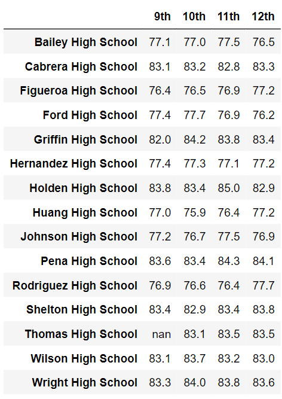
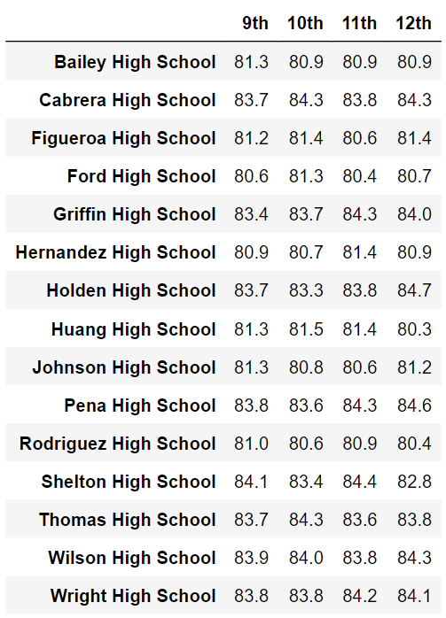
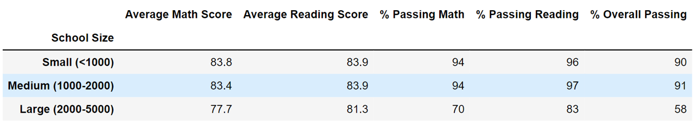

# School Analysis Challenge
Phyton data frame from a CVS

## Overview of the school district analysis:
Every year, the Py City´s school board analyzes their schools. This year the analysis was for the high schools, 9th to 12th grades. The key performance indicators are:

- Average Math Score	
- Average Reading Score	
- % Passing Math	
- % Passing Reading	
- % Overall Passing 
- Spending Ranges (Per Student)

After making the analysis, the school board has notified that data shows evidence of academic dishonesty; specifically, reading and math grades for Thomas High School ninth-graders appear to have been altered. The analysis has to be run again taking off the data of this grade and school.

## Results
____________________
How is the district summary affected? 

    The change in the district summary percentages is minimal. It is not significant

### Distric summary before

### Distric summary after

______________________
How is the school summary affected?

    The change in the school summary percentages is minimal. It is not significant

### School summary before

### School summary after

_______________________________

How does replacing the ninth graders’ math and reading scores affect Thomas High School’s performance relative to the other schools?

    Thomas High School gain 2 places in the top 5 most performing 

### Top 5 before

### Top 5 after

### Bottom 5 before

### Bottom 5 after

________________________

How does replacing the ninth-grade scores affect the following:
Math and reading scores by grade

    The information about the scores of reading and math of 9th grade from Thomas High School doesn't exist.

### Math score per school before

### Math score per school after

### Reading score per school before

### Reading score per school after

________________________________
Scores by school spending

### School spending sumary before

### School spending sumary after

__________________________________________
Scores by school size
### School size sumary before

### School size sumary after

____________________________________________
Scores by school type
### School type sumary before

### School type sumary after

## Summary

Remove 9th-grade information from the Thomas High School, doesn't have a major effect on the first analysis.

The schools that have a lower budget per student and have a small size,  and are charters,   has a major percentage of the students how to pass math and reading.

